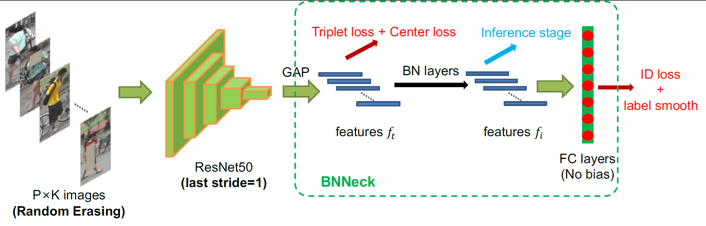

# Bag of Tricks and A Strong ReID Baseline

Bag of Tricks and A Strong Baseline for Deep Person Re-identification. CVPRW2019, Oral.

A Strong Baseline and Batch Normalization Neck for Deep Person Re-identification. IEEE Transactions on Multimedia (Accepted).

[[Journal Version(TMM)]](https://ieeexplore.ieee.org/document/8930088)
[[PDF]](http://openaccess.thecvf.com/content_CVPRW_2019/papers/TRMTMCT/Luo_Bag_of_Tricks_and_a_Strong_Baseline_for_Deep_Person_CVPRW_2019_paper.pdf)
[[Slides]](https://drive.google.com/open?id=1h9SgdJenvfoNp9PTUxPiz5_K5HFCho-V)
[[Poster]](https://drive.google.com/open?id=1izZYAwylBsrldxSMqHCH432P6hnyh1vR)

### News! Based on the strong baseline, we won 3rd place on AICity Challenge 2020. [[PDF]](https://arxiv.org/pdf/2004.10547.pdf) [[Code]](https://github.com/heshuting555/AICITY2020_DMT_VehicleReID)

### News! Our journal version has been accepted by IEEE Transactions on Multimedia.

### We are very grateful for your contribution to our project and hope that this project can help your research or work.

The codes are expanded on a [ReID-baseline](https://github.com/L1aoXingyu/reid_baseline) , which is open sourced by our co-first author [Xingyu Liao](https://github.com/L1aoXingyu).

Another re-implement is developed by python2.7 and pytorch0.4. [[link]](https://github.com/wangguanan/Pytorch-Person-REID-Baseline-Bag-of-Tricks)

A tiny repo with simple re-implement. [[link]](https://github.com/lulujianjie/person-reid-tiny-baseline)

Our baseline also achieves great performance on __Vehicle ReID__ task! [[link]](https://github.com/DTennant/reid_baseline_with_syncbn)

With Ranked List loss(CVPR2019)[[link]](http://openaccess.thecvf.com/content_CVPR_2019/papers/Wang_Ranked_List_Loss_for_Deep_Metric_Learning_CVPR_2019_paper.pdf), our baseline can achieve better performance. [[link]](https://github.com/Qidian213/Ranked_Person_ReID)


```
@InProceedings{Luo_2019_CVPR_Workshops,
author = {Luo, Hao and Gu, Youzhi and Liao, Xingyu and Lai, Shenqi and Jiang, Wei},
title = {Bag of Tricks and a Strong Baseline for Deep Person Re-Identification},
booktitle = {The IEEE Conference on Computer Vision and Pattern Recognition (CVPR) Workshops},
month = {June},
year = {2019}
}

@ARTICLE{Luo_2019_Strong_TMM, 
author={H. {Luo} and W. {Jiang} and Y. {Gu} and F. {Liu} and X. {Liao} and S. {Lai} and J. {Gu}}, 
journal={IEEE Transactions on Multimedia}, 
title={A Strong Baseline and Batch Normalization Neck for Deep Person Re-identification}, 
year={2019}, 
pages={1-1}, 
doi={10.1109/TMM.2019.2958756}, 
ISSN={1941-0077}, 
}
```

## Authors
- [Hao Luo](https://github.com/michuanhaohao)
- [Youzhi Gu](https://github.com/shaoniangu)
- [Xingyu Liao](https://github.com/L1aoXingyu)
- [Shenqi Lai](https://github.com/xiaolai-sqlai)

We support
- [x] easy dataset preparation
- [x] end-to-end training and evaluation
- [x] high modular management
- [x] speed up inference [[link]](https://github.com/DTennant/reid_baseline_with_syncbn)
- [x] support multi-gpus training [[link]](https://github.com/DTennant/reid_baseline_with_syncbn)

Bag of tricks
- Warm up learning rate
- Random erasing augmentation
- Label smoothing
- Last stride
- BNNeck
- Center loss

## TODO list
In the future, we will
- [] support more datasets
- [] support more models
- [] explore more tricks


## Pipeline
<div align=center>

</div>

## Results (rank1/mAP)
| Model | Market1501 | DukeMTMC-reID |
| --- | -- | -- |
| Standard baseline | 87.7 (74.0) |  79.7 (63.8) |
| +Warmup | 88.7 (75.2) |  80.6(65.1) |
| +Random erasing augmentation | 91.3 (79.3) |  81.5 (68.3) |
| +Label smoothing | 91.4 (80.3) |  82.4 (69.3) |
| +Last stride=1 | 92.0 (81.7) | 82.6 (70.6) |
| +BNNeck | 94.1 (85.7) | 86.2 (75.9) |
| +Center loss | 94.5 (85.9) | 86.4 (76.4) |
| +Reranking | 95.4 (94.2) | 90.3 (89.1) |

| Backbone | Market1501 | DukeMTMC-reID |
| --- | -- | -- |
| ResNet18 | 91.7 (77.8) |  82.5 (68.8) |
| ResNet34 | 92.7 (82.7) |  86.4(73.6) |
| ResNet50 | 94.5 (85.9) | 86.4 (76.4) |
| ResNet101 | 94.5 (87.1) |  87.6 (77.6) |
| ResNet152 | 80.9 (59.0) | 87.5 (78.0) |
| SeResNet50 | 94.4 (86.3) | 86.4 (76.5) |
| SeResNet101 | 94.6 (87.3) | 87.5 (78.0) |
| SeResNeXt50 | 94.9 (87.6) | 88.0 (78.3) |
| SeResNeXt101 | 95.0 (88.0) | 88.4 (79.0) |
| IBN-Net50-a | 95.0 (88.2) | 90.1 (79.1) |

[model(Market1501)](https://drive.google.com/open?id=1hn0sXLZ5yJcxtmuY-ItQfYD7hBtHwt7A)

[model(DukeMTMC-reID)](https://drive.google.com/open?id=1LARvQe-gUbflbanidUM0keKmHoKTpLUj)

## Get Started
The designed architecture follows this guide [PyTorch-Project-Template](https://github.com/L1aoXingyu/PyTorch-Project-Template), you can check each folder's purpose by yourself.

1. `cd` to folder where you want to download this repo

2. Run `git clone https://github.com/michuanhaohao/reid-strong-baseline.git`

3. Install dependencies:
    - [pytorch>=0.4](https://pytorch.org/)
    - torchvision
    - [ignite=0.1.2](https://github.com/pytorch/ignite) (Note: V0.2.0 may result in an error)
    - [yacs](https://github.com/rbgirshick/yacs)

4. Prepare dataset

    Create a directory to store reid datasets under this repo or outside this repo. Remember to set your path to the root of the dataset in `config/defaults.py` for all training and testing or set in every single config file in `configs/` or set in every single command.

    You can create a directory to store reid datasets under this repo via

    ```bash
    cd reid-strong-baseline
    mkdir data
    ```

    （1）Market1501

    * Download dataset to `data/` from http://www.liangzheng.org/Project/project_reid.html
    * Extract dataset and rename to `market1501`. The data structure would like:

    ```bash
    data
        market1501 # this folder contains 6 files.
            bounding_box_test/
            bounding_box_train/
            ......
    ```
    （2）DukeMTMC-reID

    * Download dataset to `data/` from https://github.com/layumi/DukeMTMC-reID_evaluation#download-dataset
    * Extract dataset and rename to `dukemtmc-reid`. The data structure would like:

    ```bash
    data
        dukemtmc-reid
        	DukeMTMC-reID # this folder contains 8 files.
            	bounding_box_test/
            	bounding_box_train/
            	......
    ```

5. Prepare pretrained model if you don't have

    （1）ResNet

    ```python
    from torchvision import models
    models.resnet50(pretrained=True)
    ```
    （2）Senet

    ```python
    import torch.utils.model_zoo as model_zoo
    model_zoo.load_url('the pth you want to download (specific urls are listed in  ./modeling/backbones/senet.py)')
    ```
    Then it will automatically download model in `~/.torch/models/`, you should set this path in `config/defaults.py` for all training or set in every single training config file in `configs/` or set in every single command.

    （3）ResNet_IBN_a

    You can download the ImageNet pre-trained weights from here [[link]](https://drive.google.com/open?id=1_r4wp14hEMkABVow58Xr4mPg7gvgOMto)

    （4）Load your self-trained model
    If you want to continue your train process based on your self-trained model, you can change the configuration `PRETRAIN_CHOICE` from 'imagenet' to 'self' and set the `PRETRAIN_PATH` to your self-trained model. We offer `Experiment-pretrain_choice-all_tricks-tri_center-market.sh` as an example. 

6. If you want to know the detailed configurations and their meaning, please refer to `config/defaults.py`. If you want to set your own parameters, you can follow our method: create a new yml file, then set your own parameters.  Add `--config_file='configs/your yml file'` int the commands described below, then our code will merge your configuration. automatically.

## Train
You can run these commands in  `.sh ` files for training different datasets of differernt loss.  You can also directly run code `sh *.sh` to run our demo after your custom modification.

1. Market1501, cross entropy loss + triplet loss

```bash
python3 tools/train.py --config_file='configs/softmax_triplet.yml' MODEL.DEVICE_ID "('your device id')" DATASETS.NAMES "('market1501')" OUTPUT_DIR "('your path to save checkpoints and logs')"
```

2. DukeMTMC-reID, cross entropy loss + triplet loss + center loss


```bash
python3 tools/train.py --config_file='configs/softmax_triplet_with_center.yml' MODEL.DEVICE_ID "('your device id')" DATASETS.NAMES "('dukemtmc')" OUTPUT_DIR "('your path to save checkpoints and logs')"
```

## Test
You can test your model's performance directly by running these commands in `.sh ` files after your custom modification. You can also change the configuration to determine which feature of BNNeck is used and whether the feature is normalized (equivalent to use Cosine distance or Euclidean distance) for testing.

Please replace the data path of the model and set the `PRETRAIN_CHOICE` as 'self' to avoid time consuming on loading ImageNet pretrained model.

1. Test with Euclidean distance using feature before BN without re-ranking,.

```bash
python3 tools/test.py --config_file='configs/softmax_triplet_with_center.yml' MODEL.DEVICE_ID "('your device id')" DATASETS.NAMES "('market1501')" TEST.NECK_FEAT "('before')" TEST.FEAT_NORM "('no')" MODEL.PRETRAIN_CHOICE "('self')" TEST.WEIGHT "('your path to trained checkpoints')"
```
2. Test with Cosine distance using feature after BN without re-ranking,.

```bash
python3 tools/test.py --config_file='configs/softmax_triplet_with_center.yml' MODEL.DEVICE_ID "('your device id')" DATASETS.NAMES "('market1501')" TEST.NECK_FEAT "('after')" TEST.FEAT_NORM "('yes')" MODEL.PRETRAIN_CHOICE "('self')" TEST.WEIGHT "('your path to trained checkpoints')"
```
3. Test with Cosine distance using feature after BN with re-ranking

```bash
python3 tools/test.py --config_file='configs/softmax_triplet_with_center.yml' MODEL.DEVICE_ID "('your device id')" DATASETS.NAMES "('dukemtmc')" TEST.NECK_FEAT "('after')" TEST.FEAT_NORM "('yes')" MODEL.PRETRAIN_CHOICE "('self')" TEST.RE_RANKING "('yes')" TEST.WEIGHT "('your path to trained checkpoints')"
```

